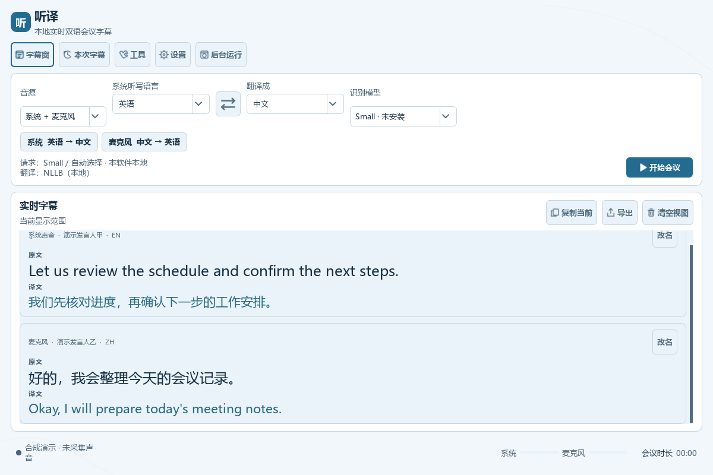
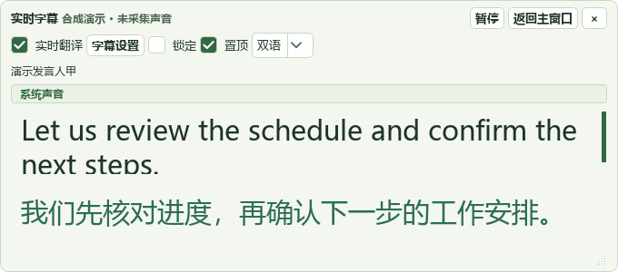

# 听译 · WhisperLiveKit 中文会议桌面

[源码仓库](https://github.com/SunTBurst/tingyi-whisperlivekit) · [安装说明](docs/INSTALL.md) · [已知问题](docs/KNOWN_ISSUES.md) · [第三方许可](THIRD_PARTY_NOTICES.md)

听译是一款面向中文使用者的 Windows 本地会议字幕工具。它给固定版本的 [WhisperLiveKit](https://github.com/QuentinFuxa/WhisperLiveKit) 增加桌面操作层：系统声音和麦克风采集、中文设置、独立字幕窗、模型管理、词库及会议记录。流式识别、翻译、说话人分离与服务接口继续使用原库；上游固定在 0.2.26、commit `363e4f6d029694d9c81ae548beddd9d3c88a3637`。

这是源码发布，不附带 Python 环境、模型、安装包或打包 EXE。首次安装需要联网，安装和下载必要模型后，本地模式可以离线处理会议。默认语音识别不依赖 LM Studio。

当前阶段为 **Windows 源码预览版**。公开副本回归为405项及22个子测试通过、1项因缺少可选权重跳过、1项复现已知音频尾块缺陷；不是全绿或跨电脑安装验收。详见 [公开副本验证](docs/TESTING.md)。



## 常用功能

- 系统声音、麦克风或两路同时采集；两路可分别保留来源与语言方向。
- 中英文双向听写与翻译；可选择阿拉伯语等受所选后端支持的语言。
- 会议中修改听写语言、翻译目标；暂停完成后更换模型、设备与其他配置，再接续同一会议。
- 独立字幕悬浮窗，原文、译文或双语对照；字体、字号、颜色、透明度、尺寸、置顶和锁定可调。
- 深色、晴空蓝、春意绿整套界面主题，字幕默认同步跟随。
- CSV / XLSX 词库模板、导入预览与纠错；保留原始识别文本，历史重译由使用者主动执行。
- 说话人声音分组，人工填写姓名及确认跨流段关联；不自动识别真实身份。
- 增量会议记录、异常恢复，TXT / SRT / VTT / JSON 等导出，保留原生词时间。
- 模型管理、原库服务 / 网页 / CLI / 文件任务；高级入口覆盖固定版本118项配置。
- 可选 LM Studio 会议问答、摘要和翻译，结果与原始会议资料分开保存并提示核对。

## 三类模型的分工

| 组件 | 用途 | 是否必需 |
|---|---|---|
| Whisper / faster-whisper | 把声音转成文字 | 本地语音识别需要对应权重 |
| NLLB | 把文字翻译成指定语言 | 使用本地 NLLB 翻译时需要；权重有非商业限制 |
| LM Studio 文本模型 | 问答、摘要，可选翻译 | 可选；不能代替 Whisper 语音识别 |

Whisper 内置的直接翻译目标是英语。翻译成中文及其他指定语言需使用相应文本翻译后端。

## 从源码开始

准备 Windows 10/11、[Git for Windows](https://git-scm.com/downloads/win) 和 [uv](https://docs.astral.sh/uv/getting-started/installation/)，然后在 PowerShell 中运行：

```powershell
git clone https://github.com/SunTBurst/tingyi-whisperlivekit.git
cd tingyi-whisperlivekit
powershell -NoProfile -ExecutionPolicy Bypass -File .\Setup.ps1
powershell -NoProfile -ExecutionPolicy Bypass -File .\Start.ps1
```

安装脚本获取固定上游、准备 Python 3.12 和桌面依赖。打开界面不要求先下载 Medium 模型；开始听写前，从“会议工具 → 模型”主动安装需要的 Whisper 模型，或登记已有模型目录。可先把实时翻译关闭，验证本机语音识别与音源。

需要 NLLB 时，阅读其模型许可后单独执行 `Download-NLLB.ps1` 并确认，或使用已取得的合规本地权重。环境安装与修复不自动下载权重。说话人分离另需 `scripts/setup_speaker.py` 所准备的隔离环境和模型。GPU、可选后端及依赖调整见[安装说明](docs/INSTALL.md)。

`requirements-public.txt` 是源码安装入口的直接依赖列表；上游依赖由固定源码声明解析。`requirements.lock.txt` 只记录原 Windows CUDA 验收环境，包含特定 Torch / torchaudio 版本，不是 CPU或所有电脑的通用锁文件。新电脑的冷安装、资源占用和真实会议效果仍需验证。

## 字幕窗口与主题

主窗口负责设置和管理。点击“字幕窗”后可把主窗口转入后台，并从字幕窗或系统托盘返回。



软件风格在“设置 → 常用设置 → 记录与字幕”切换。字幕默认开启“跟随软件主题配色”；关闭后使用保存的自选颜色。预览取消会恢复原设置。

## 验证范围与限制

原维护环境完整壳回归通过401项测试和22个子测试；三种主题完成108张真实控件截图、30项显示检查。验收包含合成语音、公开样例、加速音频和实际 Windows 采音。它们不代表任意电脑的真实长会稳定性或专业翻译准确率。

说话人分组不是身份认证；恢复只保留已保存文字；自动听写语言与 NLLB 实时翻译的部分组合不支持；小型文本模型可能漏掉行动项。已有音频尾部浮点边界问题保留原测试，不通过放宽断言掩盖。详见[已知问题](docs/KNOWN_ISSUES.md)。

## 隐私与源码范围

默认保存会议文字，不保存会议音频。数据由使用者保存在本机 `data/`、`records/`；模型、日志及运行环境也留在各自本机。主动配置远程 ASR 或文本端点时，声音或字幕将按所选端点传输。

本公开副本采用独立干净提交历史，排除原工作区历史、个人配置、会议资料、凭据、运行日志、模型、测试音频及第三方二进制。截图仅使用合成文字和演示状态，不证明截图中的模型已实际加载。提交问题时请使用脱敏或合成资料。

## 许可

桌面应用原创源码采用 **GPL-3.0-or-later**，版权归 SunTBurst / 听译贡献者。完整文本见 [LICENSE](LICENSE)。PyQt、固定 WhisperLiveKit、其他依赖及各模型继续保留独立许可和版权；NLLB 的非商业条件不会被应用代码许可改变。参见 [THIRD_PARTY_NOTICES.md](THIRD_PARTY_NOTICES.md)。
